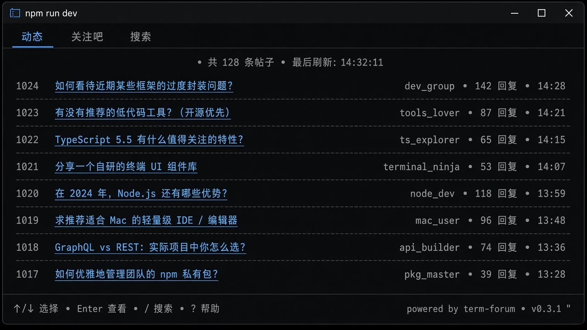
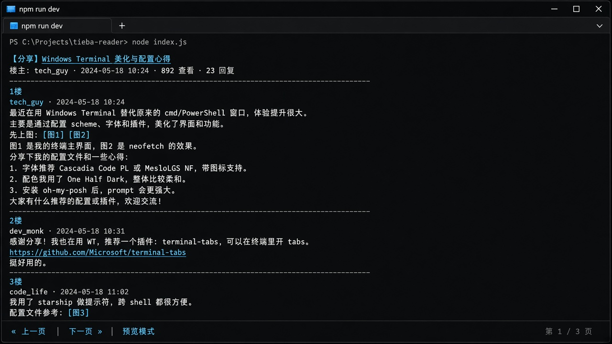
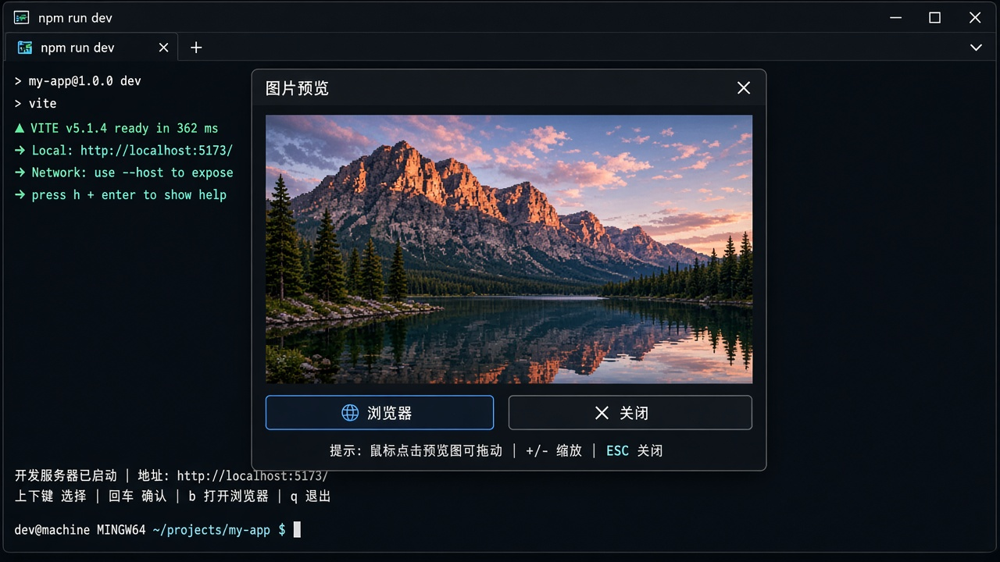

# fishingTB

在终端里刷贴吧的 Textual TUI —— 键盘/鼠标都能用，窗口标题可伪装成 `npm run dev`，一键老板键切走。

[](https://www.python.org/downloads/)
[](https://textual.textualize.io/)
[](LICENSE)

---

## 特性

| | |
|---|---|
| **登录** | 终端扫码登录（百度 App），凭证写入本地 `config.yaml` |
| **浏览** | 关注动态、已关注吧、搜索进吧；帖列表与楼层阅读 |
| **图片** | 帖内 `[图N]` 弹窗预览；Windows Terminal 下优先 Sixel，否则回退字符渲染 |
| **摸鱼** | 可配置窗口标题；`` ` `` 老板键秒切伪装屏 |
| **性能** | 图片 HTTP 复用、磁盘/内存缓存（启动时清空图片磁盘缓存） |

## 环境要求

- **Python 3.10+**
- 推荐 **[Windows Terminal](https://github.com/microsoft/terminal)**（Sixel 彩色图预览体验最好）
- 贴吧账号（扫码登录）

## 快速开始

```bash
git clone https://github.com/andrewtarget/fishingTB.git
cd fishingTB
python -m venv .venv
.venv\Scripts\activate          # Windows
# source .venv/bin/activate     # macOS / Linux

pip install -r requirements.txt
copy config.example.yaml config.yaml   # Windows
# cp config.example.yaml config.yaml   # Unix
```

**方式 A — 进 TUI 再扫码**

```bash
python main.py
```

**方式 B — 仅登录（不进界面）**

```bash
python main.py login
```

首次使用把 `config.example.yaml` 拷成 `config.yaml`；登录成功后不要提交 `config.yaml`（已在 `.gitignore`）。

## 配置

`config.yaml`（项目根目录，见 `config.example.yaml`）：

| 键 | 说明 |
|----|------|
| `bduss` / `stoken` | 登录后自动写入 |
| `terminal_title` | 终端标题，默认 `npm run dev` |
| `recent_forums` | 最近访问的吧 |
| `image_renderer` | `auto` \| `sixel` \| `braille` \| `halfblock` |

`auto`：Windows Terminal 用 Sixel，其它终端用 braille 回退。

## 常用操作

| 场景 | 操作 |
|------|------|
| 退出 | `q` |
| 老板键 | `` ` `` |
| 帖内图片 | 点 `[图N]` 或快捷键（见界面提示） |
| 预览内浏览器打开 | `o` |
| 登出 / 返回 | 登录页按钮 |

## 项目结构

```
fishingTB/
├── main.py                 # 入口：tui | login
├── config.example.yaml
├── fishingtb/
│   ├── ui/                 # Textual 界面
│   ├── feeds/              # 吧列表、动态
│   ├── media/              # 图片下载与终端渲染
│   └── auth/               # 扫码登录
├── scripts/                # smoke / pilot 测试
└── docs/screenshots/       # README 截图
```

## 开发

```bash
python scripts/smoke_test.py
python scripts/pilot_test.py
```

## 截图

> 以下为界面示意（终端主题与字体因环境而异）。

### 主页 · 动态 / 吧列表



### 帖子阅读



### 图片预览



---

## 免责声明

本项目仅供学习与个人使用。请遵守百度贴吧服务条款与当地法律法规；勿用于未授权爬取、传播或商用。使用本软件产生的风险由使用者自行承担。

## License

MIT — 见 [LICENSE](LICENSE)。
